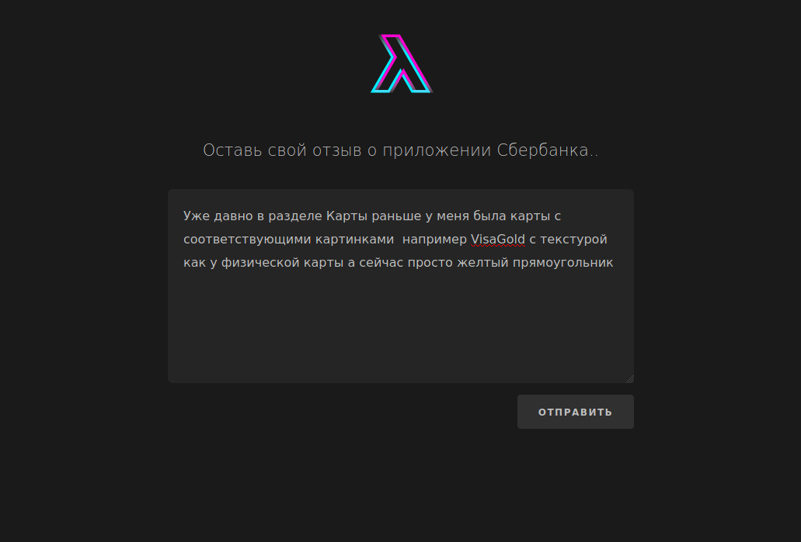
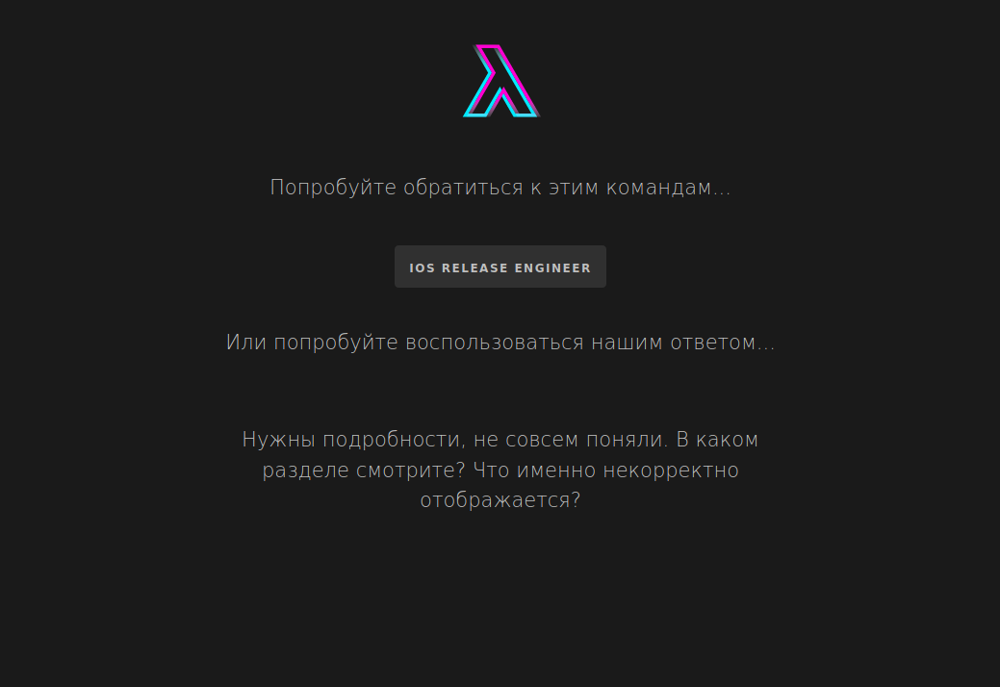

# README


## Описание задачи

Тематическое моделирование с использование модели (Attention Based Aspect Extraction).
Собрали данные, и начали обучать с квелечением количества аспектов (топиков) дошли до 130 модель показала 0.7 время обучени 7 часов, loss при остановке 1.134.
Самостоятельно интерпритировали результаты ABAE разделив их в соответсвии с зонами ответсвенностями команд.

## Изображения 





## Технические особенности
Модель реализована с использование модели ABAE, для запуска необходимо скачать [векторную модель](http://vectors.nlpl.eu/repository/20/180.zip)
и положить model.bin в папку `src/main/preprocessed_data/appstore/`.

Локальный запуск.
```
virtualenv venv
eval $(cat .env.dev | sed 's/^/export /')
cd src
pip install -r requirements.txt
python manage.py runserver
```

Время сборки и запуска Докер Образа ~ 20-30 мин.

## Результат 
🥇1 место в треке Sberbank Online 

[Выступление](https://sbercode.tech/) - 45 минута

## Дополнительные ссылки

Модель ABAE - https://github.com/madrugado/Attention-Based-Aspect-Extraction

Модель ABAE (org) - https://github.com/ruidan/Unsupervised-Aspect-Extraction

Полная статья - https://www.aclweb.org/anthology/P17-1036.pdf

iOS приложение - https://github.com/godemodegame/SberOnline

Генерация авто ответа - https://github.com/MaximDmitrievich/SberOnline

## Контакты

mr8bit@yandex.ru

# Cite
If you use the code, please consider citing original paper:
```
@InProceedings{he-EtAl:2017:Long2,
  author    = {He, Ruidan  and  Lee, Wee Sun  and  Ng, Hwee Tou  and  Dahlmeier, Daniel},
  title     = {An Unsupervised Neural Attention Model for Aspect Extraction},
  booktitle = {Proceedings of the 55th Annual Meeting of the Association for Computational Linguistics (Volume 1: Long Papers)},
  month     = {July},
  year      = {2017},
  address   = {Vancouver, Canada},
  publisher = {Association for Computational Linguistics}
}
```
